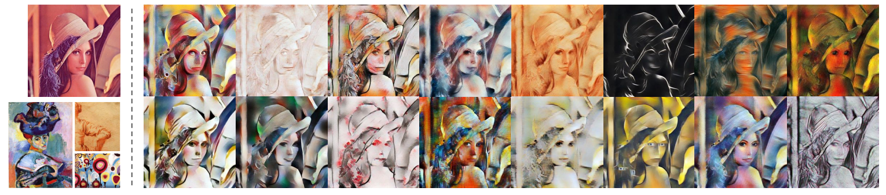

# StyleMixer: Cloud-based Neural Style Transfer Service

## Introduction

In this project, we build a cloud-based service for neural style transfer and deploy our service to the **AWS AppRunner** [[Link](https://ktthnbhkmf.us-east-1.awsapprunner.com/)]. The motivation of this project is based on our previously pubished paper *"Style Mixer: Semantic-aware Multi-Style Transfer Network"* [[Paper](https://arxiv.org/abs/1910.13093)] [[Github](https://github.com/zxhuang97/Official-implementation-StyleMixer)]. Specifically, our application enables users to enjoy powerful functions of style transfer to generate fancy images via operations as simple as only button-clicks.

## Background

Thanks to the development of computer vision and graphics technology, recent years have witnessed an increasing number of photo apps for image editing. **Style Transfer**, which takes a **content image** and a **style image** as inputs to synthesize a stylized image, has become more and more popular. Given a photo of a women (upper left corner) and art works with different styles (bottom left corner), the algorithm can generate stylized versions of the same women without compromising its content. 



Typically, the script of style transfer requires complicated operations and involves deep neural network for image processing (figure below illustrates a standard pipeline of style transfer). However, this is not user-friendly to users without computer science background. To this end, we build this application and deploy it as a cloud-based service to allow all sorts of users to enjoy the charm of style transfer. Generally speaking, with our StyleMixer, you can upload your own image and choose a style you like as provided by our service. Then, you will be able to get a stylized version of your uploaded content image.


Here's an example of content image (a photo of duke!!!), style image (from Wikiart) and stylized image.
- Photo of Duke:

    

- style image:

    

- The output:

    

## Usage
- Please use **High Resolution images** or it may block our API
- It may take some times to render the output **DON'T REFRESH THE PAGE** while waiting
- Project address: https://ktthnbhkmf.us-east-1.awsapprunner.com/

- If you hover cursor over the "Style List" button, you can overview the style images.
- Example layout while processing

    


## Architecure
The solution will set up a CodePipeline that pulls the code from GitHub and builds the codes, then stores the container image artifact in Amazon ECR. App Runner is configured to trigger automatic deployments once a new image is pushed to ECR. Python applications running in App Runner will stream the log to Amazon CloudWatch.


  

## Implements

- Frontend
    - We employed ```Booststrapt```  to construct the responsive layout, and utilized ```Ajax``` to render the progress bar and output asynchronously.

- Backend
    - We implemented two versions of this application, one is in Rust and the other one is in Python.
    - For the Rust version, we used the ```actix Web``` framework to handle the frontend request in a asynchromous way and respond the frontend request with JSON data.
    - For the Python version, we used ```Flask``` to handle the frontend requests.

- This application can read the user uploaded images at frontend and query the progress and output via our API at backend.


## Deployment
- Create ECR and build docker image in Cloud9 environment.

    

- Push the latest image to ECR

    
    

- Run the service using APP runner

    

## Monitor

* Create two alarm in `AWS CloudWatch` to monitor the CPU utilization and memory utilization and request amount of the service. 
    
    

* If the CPU utilization or memory utilization is higher than 80% for 5 minutes, the alarm will be triggered and send a notification to our email.

    


* If the request amount is higher than 100 for 5 minutes, the alarm will be triggered and send a notification to our email.

    


